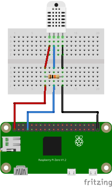

# Temperature and Humidity Sensor (Raspberry Pi)

This project reads temperature and humidity from a DHT22 sensor on a Raspberry Pi and publishes the readings to an MQTT broker.

## Requirements
- Raspberry Pi (with GPIO)
- 10kΩ pull-up resistor
- DHT22 sensor
- Python 3.7+
- Poetry

## Wiring Diagram



## Setup

1. Clone this repository to your Raspberry Pi.
2. If using a Raspberry Pi Zero 2 W:
   ```sh
   sudo apt install libffi-dev pkg-config
   ```
3. Install dependencies:
   ```sh
   poetry install
   ```
4. Create a `.env` file for configuration:
   ```sh
   cp .env.example .env
   ```
   Edit `.env` and set your MQTT broker details:
   ```
   MQTT_BROKER=192.168.1.100  # Your MQTT broker IP
   MQTT_PORT=1883
   READ_INTERVAL=900          # Read interval in seconds (default: 900, 15 minutes)
   ```
5. Connect your DHT sensor to the correct GPIO pin (default is GPIO4).
6. Run the script:
   ```sh
   # Option 1: Direct Python execution
   poetry run python -m rpi_dht22.publish_sensor_data
   
   # Option 2: Using the script entry point
   poetry run publish-sensor
   ```

### Notes
- The `adafruit-circuitpython-dht` library is used for sensor reading.
- If running on a non-Raspberry Pi system, sensor reading will not work.
- You may need to run as root (`sudo`) on the Pi for GPIO access.

## Testing
To verify that the MQTT messages are being published, you can use the `mosquitto_sub` command:

```sh
mosquitto_sub -h localhost -t "sensors/dht22/#" -v
```
## License
MIT
